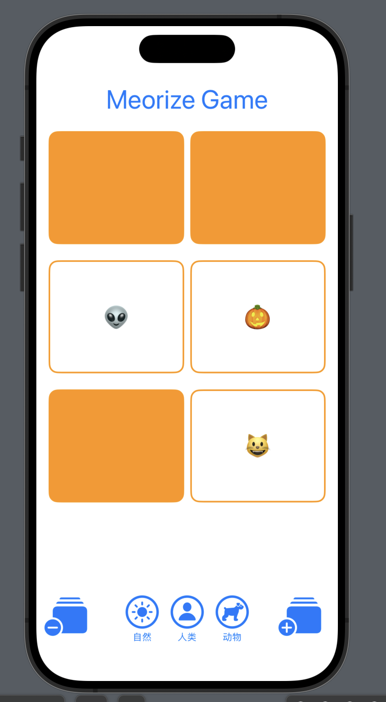

test
2023.11.26 zxc

## 首屏幕截图

| 第一天 |
| --- | 
|  |
| 所需任务

1. 获取记住游戏的工作方式如讲座 1 和 2 中所示。输入所有代码。不要从任何地方复制/粘贴。done
2. 完成此操作后，您可以随意删除⊖和⊕屏幕底部的按钮（或不，由您选择）以及支持它的所有代码。done
3. 添加标题“记住！”到屏幕顶部。这是一个标题，所以应该使用大字体。done
4. 添加至少3 个“主题选择”按钮用户界面，每一个都会导致所有卡片的表情符号被替换为所选主题中的新表情符号。 “主题”只是指相关表情符号的集合（例如，在讲座中我们基本上有一个“万圣节“ 主题）。done
5. 卡片面朝上或面朝下状态不影响不是当用户更改主题时需要更改。
6. 3个主题中每个主题的卡片对数量应该不同，但在任何情况下都不能少于4对。请注意，您必须放置一个一对将主题中的每个表情符号放入用户界面（这记住否则游戏就没有意义了！）。
7. 触摸主题按钮时出现的卡片应以不可预测（即随机）的顺序排列。换句话说，每次选择主题按钮时都应该洗牌。
   .shuffled()
8. 主题选择按钮必须包含代表主题的图像和描述主题的文本，它们垂直堆叠在一起。 done
9. 每个主题选择按钮的图像部分必须使用SF符号这唤起了它所选择的主题的想法（比如汽车符号汽车主题如图所示截屏下一节）。
10. 主题选择按钮的文字描述必须使用比我们为卡片上的表情符号选择的字体明显更小的字体。done
11. 更改代码，使卡片默认面朝下而不是面朝上显示（这可能是您要做的最后一件事，因为让它们默认面朝上显示会很方便，因为您可以处理所有所需任务多于）。不过，一旦你这样做了，当我们下周添加游戏逻辑时，你将能够感受到“玩游戏”的感觉。
12. 你的用户界面应该在任何设备上以纵向或横向方式工作iPhone并且在浅色模式和深色模式下看起来都不错。这可能不需要您做任何工作（这是斯威夫特用户界面），但请务必尝试两种方向、深色和浅色模式以及各种尺寸的设备。|

